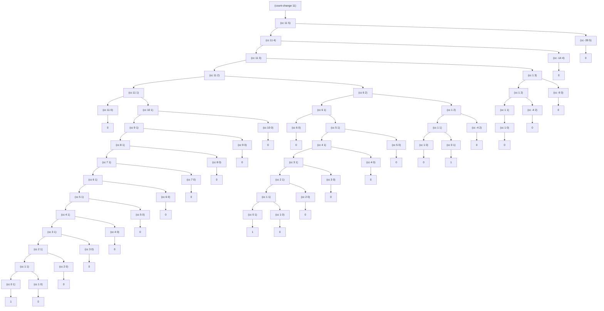

# Tree illustration of the `count-change` procedure making change for 11 cents.

# Orders of growth
## Space
The largest space that takes up is when processing `(cc amount kinds-of-coins)` when `kinds-of-coins` is $1$.  
So, the order of growth of the space is $\Theta(n)$ where $n$ is `amount`.

## Number of steps
I will break this down by the value of `kinds-of-coins`.  
I will write the number of steps of `cc` as $S(n,m)$ where $n$ is `amount` and $m$ is `kinds-of-coins`.
### When $m = 1$
For each call to `(cc n 1)`, it calls `(cc n-1 1)` and `(cc n 0)` while $n\gt0$.   
i.e. When $n=1$, the number of steps is $3$. When $n=2$, the number of steps is $5$. And so on.

Therefore, 

$$
S(n,1)=2n+1
$$
### When $m = 2$
For each call to `(cc n 2)`, it makes recursive calls to `(cc n-5 2)` and `(cc n 1)` while $n\gt0$.   
Which means, `(cc x 2)` is called $\lfloor\frac{n}{5}\rfloor+1$ times and `(cc x 1)` is called each time. Furthermore, I need to account for the call that is made when $n\le0$ (the last $+1$).

$$
S(n,2)=\lfloor\frac{n}{5}\rfloor+1+\sum_{i=0}^{\lfloor\frac{n}{5}\rfloor}{S(n-5i,1)}+1
$$

Assuming $n$ is sufficiently big number, ignoring the floor sign...

$$
S(n,2)=\frac{n}{5}+1+\sum_{i=0}^{\frac{n}{5}}{S(n-5i,1)}+1
$$

And since we previously found that $S(n,1)=2n+1$

$$
\begin{align}
S(n,2)&=\frac{n}{5}+1+\sum_{i=0}^{\frac{n}{5}}{(2(n-5i)+1)}+1\\
&=\frac{n}{5}+1+\sum_{i=0}^{\frac{n}{5}}{(2n-10i+1)}+1\\
&=\frac{n}{5}+1+\sum_{i=0}^{\frac{n}{5}}{(2n+1)}-\sum_{i=0}^{\frac{n}{5}}{(10i)}+1\\
&=\frac{n}{5}+1+(\frac{n}{5}+1)(2n+1)-10\cdot\frac{\frac{n}{5}(\frac{n}{5}+1)}{2}+1\\
&=\frac{n}{5}+1+\frac{2n^2}{5}+\frac{11n}{5}+1-\frac{n^2}{5}-n+1\\
&=\frac{n^2}{5}+\frac{7n}{5}+3
\end{align}
$$

Therefore, 

$$
S(n,2)=\frac{n^2}{5}+\frac{7n}{5}+3
$$

### When $m=3$
For each call to `(cc n 3)`, it makes recursive calls to `(cc n-10 3)` and `(cc n 2)` while $n\gt0$.   
Which means, `(cc x 3)` is called $\lfloor\frac{n}{10}\rfloor+1$ times and `(cc x 2)` is called each time. Furthermore, I need to account for the call that is made when $n\le0$ (the last $+1$).

$$
S(n,3)=\lfloor\frac{n}{10}\rfloor+1+\sum_{i=0}^{\lfloor\frac{n}{10}\rfloor}{S(n-10i,2)}+1
$$

Assuming $n$ is sufficiently big number, ignoring the floor sign...

$$
S(n,3)=\frac{n}{10}+1+\sum_{i=0}^{\frac{n}{10}}{S(n-10i,2)}+1
$$

And since we previously found that $S(n,2)=\frac{n^2}{5}+\frac{7n}{5}+3$

$$
\begin{align}
S(n,3)&=\frac{n}{10}+1+\sum_{i=0}^{\frac{n}{10}}{(\frac{(n-10i)^2}{5}+\frac{7(n-10i)}{5}+3)}+1\\
&=\frac{n}{10}+1+\sum_{i=0}^{\frac{n}{10}}{(\frac{n^2-20in+100i^2}{5}+\frac{7n-70i}{5}+3)}+1\\
&=\frac{n}{10}+1+\sum_{i=0}^{\frac{n}{10}}{(\frac{n^2+7n+15}{5}+20i^2-(14+4n)i)}+1\\
&=\frac{n}{10}+1+\sum_{i=0}^{\frac{n}{10}}{(\frac{n^2+7n+15}{5})}+\sum_{i=0}^{\frac{n}{10}}{(20i^2)}-\sum_{i=0}^{\frac{n}{10}}{((14+4n)i)}+1\\
&=\frac{n}{10}+1+(\frac{n}{10}+1)(\frac{n^2+7n+15}{5})+20\cdot\frac{\frac{n}{10}(\frac{n}{10}+1)(2\cdot\frac{n}{10}+1)}{6}-(14+4n)\cdot\frac{\frac{n}{10}(\frac{n}{10}+1)}{2}+1\\
&=\frac{n}{10}+1+(\frac{n^3}{50}+\frac{17n^2}{50}+\frac{17n}{10}+3)+(\frac{n^3}{150}+\frac{n^2}{10}+\frac{n}{3})-(\frac{n^3}{50}+\frac{27n^2}{100}+\frac{7n}{10})+1\\
&=\frac{n^3}{150}+\frac{17n^2}{100}+\frac{43n}{30}+5
\end{align}
$$

Therefore, 

$$
S(n,3)=\frac{n^3}{150}+\frac{17n^2}{100}+\frac{43n}{30}+5
$$

### When $m=4$
For each call to `(cc n 4)`, it makes recursive calls to `(cc n-25 4)` and `(cc n 3)` while $n\gt0$.   
Which means, `(cc x 4)` is called $\lfloor\frac{n}{25}\rfloor+1$ times and `(cc x 3)` is called each time. Furthermore, I need to account for the call that is made when $n\le0$ (the last $+1$).

$$
S(n,4)=\lfloor\frac{n}{25}\rfloor+1+\sum_{i=0}^{\lfloor\frac{n}{25}\rfloor}{S(n-25i,3)}+1
$$

Assuming $n$ is sufficiently big number, ignoring the floor sign...

$$
S(n,4)=\frac{n}{25}+1+\sum_{i=0}^{\frac{n}{25}}{S(n-25i,3)}+1
$$

And since we previously found that $S(n,3)=\frac{n^3}{150}+\frac{17n^2}{100}+\frac{43n}{30}+5$

$$
\begin{align}
S(n,4)&=\frac{n}{25}+1+\sum_{i=0}^{\frac{n}{25}}{(\frac{(n-25i)^3}{150}+\frac{17(n-25i)^2}{100}+\frac{43(n-25i)}{30}+5)}+1
\end{align}
$$

Therefore[^1],

$$
S(n,4)=\frac{n^4}{15000}+\frac{7n^3}{1250}+\frac{233n^2}{1500}+\frac{341n}{200}+7
$$

### When $m=5$
For each call to `(cc n 5)`, it makes recursive calls to `(cc n-50 5)` and `(cc n 4)` while $n\gt0$.   
Which means, `(cc x 5)` is called $\lfloor\frac{n}{50}\rfloor+1$ times and `(cc x 4)` is called each time. Furthermore, I need to account for the call that is made when $n\le0$ (the last $+1$).

$$
S(n,5)=\lfloor\frac{n}{50}\rfloor+1+\sum_{i=0}^{\lfloor\frac{n}{50}\rfloor}{S(n-50i,4)}+1
$$

Assuming $n$ is sufficiently big number, ignoring the floor sign...

$$
S(n,5)=\frac{n}{50}+1+\sum_{i=0}^{\frac{n}{50}}{S(n-50i,4)}+1
$$

And since we previously found that $S(n,4)=\frac{n^4}{15000}+\frac{7n^3}{1250}+\frac{233n^2}{1500}+\frac{341n}{200}+7$

$$
\begin{align}
S(n,5)=\frac{n}{50}+1+\sum_{i=0}^{\frac{n}{50}}{(\frac{(n-50i)^4}{15000}+\frac{7(n-50i)^3}{1250}+\frac{233(n-50i)^2}{1500}+\frac{341(n-50i)}{200}+7)}+1
\end{align}
$$

Therefore,

$$
S(n,5)=\frac{n^5}{3750000}+\frac{23n^4}{375000}+\frac{371n^3}{75000}+\frac{9883n^2}{60000}+\frac{2459n}{1200}+9
$$

### Conclusion
From these calculations, we can say that the order of growth of the number of steps is:

$$
S(n,5)=\Theta(n^5)
$$

[^1]:I gave up on doing this by hand, so I use Wolfram Alpha from now on.