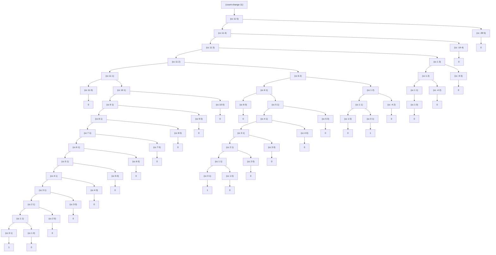

# Tree illustration of the `count-change` procedure making change for 11 cents.

```mermaid
graph TD;
init["(count-change 11)"]
cc_11_5["(cc 11 5)"]
cc_-39_5["(cc -39 5)"]
cc_-39_5-0["0"]

cc_11_4["(cc 11 4)"]
cc_-14_4["(cc -14 4)"]
cc_-14_4-0["0"]

cc_11_3["(cc 11 3)"]
cc_1_3["(cc 1 3)"]
cc_1_2a["(cc 1 2)"]
cc_1_1c["(cc 1 1)"]
cc_1_0c["(cc 1 0)"]
cc_1_0c-0["0"]

cc_-9_3["(cc -9 3)"]
cc_-9_3-0["0"]

cc_-4_2a["(cc -4 2)"]
cc_-4_2a-0["0"]

cc_11_2["(cc 11 2)"]
cc_6_2["(cc 6 2)"]
cc_6_1a["(cc 6 1)"]
cc_6_0a["(cc 6 0)"]
cc_6_0a-0["0"]

cc_5_1a["(cc 5 1)"]
cc_5_0a["(cc 5 0)"]
cc_5_0a-0["0"]
cc_4_1a["(cc 4 1)"]
cc_4_0a["(cc 4 0)"]
cc_4_0a-0["0"]
cc_3_1a["(cc 3 1)"]
cc_3_0a["(cc 3 0)"]
cc_3_0a-0["0"]
cc_2_1a["(cc 2 1)"]
cc_2_0a["(cc 2 0)"]
cc_2_0a-0["0"]
cc_1_1b["(cc 1 1)"]
cc_1_0b["(cc 1 0)"]
cc_1_0b-0["0"]
cc_0_1b["(cc 0 1)"]
cc_0_1b-1["1"]

cc_1_2["(cc 1 2)"]
cc_1_1a["(cc 1 1)"]
cc_1_0a["(cc 1 0)"]
cc_1_0a-0["0"]

cc_0_1a["(cc 0 1)"]
cc_0_1a-1["1"]

cc_-4_2["(cc -4 2)"]
cc_-4_2-0["0"]

cc_11_1["(cc 11 1)"]
cc_10_1["(cc 10 1)"]
cc_10_0["(cc 10 0)"]
cc_10_0-0["0"]
cc_9_1["(cc 9 1)"]
cc_9_0["(cc 9 0)"]
cc_9_0-0["0"]
cc_8_1["(cc 8 1)"]
cc_8_0["(cc 8 0)"]
cc_8_0-0["0"]
cc_7_1["(cc 7 1)"]
cc_7_0["(cc 7 0)"]
cc_7_0-0["0"]
cc_6_1["(cc 6 1)"]
cc_6_0["(cc 6 0)"]
cc_6_0-0["0"]
cc_5_1["(cc 5 1)"]
cc_5_0["(cc 5 0)"]
cc_5_0-0["0"]
cc_4_1["(cc 4 1)"]
cc_4_0["(cc 4 0)"]
cc_4_0-0["0"]
cc_3_1["(cc 3 1)"]
cc_3_0["(cc 3 0)"]
cc_3_0-0["0"]
cc_2_1["(cc 2 1)"]
cc_2_0["(cc 2 0)"]
cc_2_0-0["0"]
cc_1_1["(cc 1 1)"]
cc_1_0["(cc 1 0)"]
cc_1_0-0["0"]
cc_0_1["(cc 0 1)"]
cc_0_1-1["1"]

cc_11_0["(cc 11 0)"]
cc_11_0-0["0"]

init --> cc_11_5 --> cc_11_4 --> cc_11_3 --> cc_11_2 --> cc_11_1 --> cc_11_0 --> cc_11_0-0

cc_11_1 --> cc_10_1 --> cc_9_1 --> cc_8_1 --> cc_7_1 --> cc_6_1 --> cc_5_1 --> cc_4_1 --> cc_3_1 --> cc_2_1 --> cc_1_1 --> cc_0_1 --> cc_0_1-1

cc_10_1 --> cc_10_0 --> cc_10_0-0
cc_9_1 --> cc_9_0 --> cc_9_0-0
cc_8_1 --> cc_8_0 --> cc_8_0-0
cc_7_1 --> cc_7_0 --> cc_7_0-0
cc_6_1 --> cc_6_0 --> cc_6_0-0
cc_5_1 --> cc_5_0 --> cc_5_0-0
cc_4_1 --> cc_4_0 --> cc_4_0-0
cc_3_1 --> cc_3_0 --> cc_3_0-0
cc_2_1 --> cc_2_0 --> cc_2_0-0
cc_1_1 --> cc_1_0 --> cc_1_0-0

cc_11_2 --> cc_6_2 --> cc_6_1a --> cc_6_0a --> cc_6_0a-0
cc_6_2 --> cc_1_2 --> cc_1_1a --> cc_1_0a --> cc_1_0a-0
cc_1_2 --> cc_-4_2 --> cc_-4_2-0
cc_1_1a --> cc_0_1a --> cc_0_1a-1
cc_6_1a --> cc_5_1a --> cc_4_1a --> cc_3_1a --> cc_2_1a --> cc_1_1b --> cc_0_1b --> cc_0_1b-1

cc_5_1a --> cc_5_0a --> cc_5_0a-0
cc_4_1a --> cc_4_0a --> cc_4_0a-0
cc_3_1a --> cc_3_0a --> cc_3_0a-0
cc_2_1a --> cc_2_0a --> cc_2_0a-0
cc_1_1b --> cc_1_0b --> cc_1_0b-0

cc_11_3 --> cc_1_3 --> cc_1_2a --> cc_1_1c --> cc_1_0c --> cc_1_0c-0
cc_1_3 --> cc_-9_3 --> cc_-9_3-0
cc_1_2a --> cc_-4_2a --> cc_-4_2a-0

cc_11_4 --> cc_-14_4 --> cc_-14_4-0

cc_11_5 --> cc_-39_5 --> cc_-39_5-0
```
